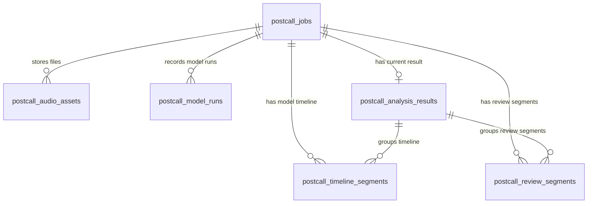

# Postcall 报警音频分析数据库表说明

本文档对应当前目标结构。数据库只保留 6 张业务表，不再因为历史实现保留重复表或重复字段。

当前设计原则：

- API 返回结果必须保存在数据库中：`postcall_analysis_results.api_result_payload` 是 `GET /api/v1/postcall/jobs/{jobId}` 的 `data` 快照。
- 模型原始输出和对外结果分开：模型时间线保存在 `postcall_timeline_segments`，对外只返回 `level`、`levelName` 和必要的 `reviewSegments`。
- `reviewSegments` 单独结构化入库，便于后续检索、复核和统计；API 当前只返回 `startSec`、`endSec`、`result`。
- 删除重复或过早设计的表：`postcall_job_duplicate_submissions`、`postcall_timeline_events`、`postcall_evidence_segments`、`postcall_callback_deliveries`。

## 1. 表关系



## 2. postcall_jobs

用途：任务主表。保存上游请求、任务状态、客户端隔离、worker 锁、重试信息。

关键字段：

| 字段 | 说明 |
| --- | --- |
| `job_id` | 对外任务编号，API 返回 `jobId` |
| `jjdh` | 接警单号，当前唯一键 |
| `audio_url` | 当前要分析的音频地址；重复提交会覆盖为新地址 |
| `bjsj` | 报警时间 |
| `raw_payload` | 原始请求体 |
| `client_id` / `source_system` | API Key 对应客户端和来源系统 |
| `state` | `processing_queued`、`processing_downloading`、`processing_analyzing`、`completed`、`failed`、`failed_cancelled` |
| `duplicate_count` | 同一 `jjdh` 重复提交次数 |
| `locked_by` / `locked_at` / `locked_until` | worker 并发认领和卡死恢复 |
| `attempt_count` / `max_attempts` / `next_run_at` | 失败重试控制 |
| `error_code` / `error_message` | 失败原因 |

重复提交规则：

- 同一 `jjdh` 保留原 `job_id`；
- 覆盖任务请求字段和 `audio_url`；
- 清理旧分析输出；
- `duplicate_count + 1`；
- 重置为 `processing_queued` 重新分析。

不再单独保存重复提交审计表。当前业务只需要知道“这个任务被重提过几次”，用 `duplicate_count` 足够。

## 3. postcall_audio_assets

用途：保存音频文件资产记录。

关键字段：

| 字段 | 说明 |
| --- | --- |
| `asset_type` | `source` 原始下载文件、`normalized` 标准化音频、后续可扩展切片文件 |
| `uri` | 本地文件或对象存储位置 |
| `sha256` | 文件哈希 |
| `sample_rate` / `channels` / `duration_sec` | 音频基础信息 |
| `size_bytes` | 文件大小 |
| `metadata` | 下载、标准化、存储相关补充信息 |

音频文件按年月日时分目录保存，便于运维清理和按时间定位。

## 4. postcall_model_runs

用途：记录每次模型或处理步骤的运行情况。

关键字段：

| 字段 | 说明 |
| --- | --- |
| `model_name` | 模型或处理步骤名称 |
| `model_version` | 模型版本或本地目录名 |
| `model_role` | `audio_preprocess`、`speaker_diarization`、`audio_event`、`voice_emotion` 等 |
| `status` | `succeeded` / `failed` |
| `started_at` / `completed_at` / `duration_ms` | 运行耗时 |
| `metrics` | 耗时、片段数等指标 |
| `output_summary` | 输出摘要，不保存完整大结果 |
| `error_code` / `error_message` | 单步骤失败原因 |

这个表用于排查“哪个模型慢、哪个步骤失败”，不参与对外结果组装。

## 5. postcall_analysis_results

用途：保存任务当前有效分析结果。一个任务只保留一条当前结果。

关键字段：

| 字段 | 说明 |
| --- | --- |
| `attention_level` | 关注等级：`1` 需要关注、`2` 建议复核、`3` 暂无明显线索 |
| `attention_level_name` | 等级中文名 |
| `rule_version` | 规则版本，例如 `postcall_attention_rules_v6` |
| `matched_rule_codes` | 本任务命中的规则编码数组 |
| `fusion_trace` | 规则线索层内部完整追踪 JSON，保存三等级结论、复合线索、被压制线索、模型冲突和不确定性信息；不直接对外返回 |
| `model_versions` | 本次使用模型版本摘要 |
| `audio_processing` | 下载、标准化、切片、profile、模型片段数等处理摘要 |
| `api_result_payload` | 对外 GET 接口 `data` 快照 |
| `api_result_version` | API 结果结构版本 |
| `api_result_generated_at` | 结果快照生成时间 |

`api_result_payload` 当前结构：

```json
{
  "jobId": "job_xxx",
  "jjdh": "JJD_20260408_0001",
  "state": "completed",
  "level": 1,
  "levelName": "需要关注",
  "reviewSegments": [
    {
      "startSec": 0.0,
      "endSec": 12.147,
      "result": "疑似哭泣"
    }
  ]
}
```

约束口径：

- `level=1/2` 时必须有非空 `reviewSegments`；
- `level=3` 时不保存 `reviewSegments`；
- 不保存 `timeline`、`insights`、`needAttention`、`riskLevel`、`analysisMode`、`beats`、`wavlm` 等旧字段；
- 规则版本和命中规则仍用 `rule_version`、`matched_rule_codes` 两个明确字段保存；
- `fusion_trace` 只保存内部排查所需的专家级规则过程，不作为 GET 外部响应字段。

## 6. postcall_timeline_segments

用途：保存模型时间线原始输出。它是规则重算和内部排查的来源，不直接作为外部 GET 返回。

关键字段：

| 字段 | 说明 |
| --- | --- |
| `segment_id` | 内部时间窗编号，例如 `seg_000001` |
| `start_sec` / `end_sec` | 片段时间 |
| `speaker_label` | pyannote 聚类标签，例如 `SPEAKER_00`；声音事件为空 |
| `speaker_role` | 当前通常为 `未知`，没有可靠依据不写报警人/接警员 |
| `role_source` | `global_audio`、`diarization_only`、`energy_vad` |
| `audio_event_scores` | 声音事件 Top-K，单项包含 `eventNameEn`、`eventNameZh`、`score` |
| `voice_emotion_scores` | 人声状态 9 类分数，单项包含 `emotionNameEn`、`emotionNameZh`、`score` |
| `voice_detailed_scores` | WavLM 17 类细粒度分数，仅内部保存，当前不对外展示 |
| `voice_emotion_dimensions` | `arousal`、`valence`、`dominance` 连续维度 |
| `internal_payload` | 模型名、版本、窗口参数、BEATs 527 类完整分数等内部细节 |

不再保存 `segment_payload`。原因是它和结构化列内容重复，后续规则重算可从结构化列重建 timeline 输入，避免两份数据不一致。

## 7. postcall_review_segments

用途：保存规则层筛出的重点复核片段完整证据。它是 `api_result_payload.reviewSegments` 的结构化明细表。

关键字段：

| 字段 | 说明 |
| --- | --- |
| `segment_id` | 复核片段编号，例如 `review_000001` |
| `start_sec` / `end_sec` | 复核片段时间 |
| `level` / `level_name` | 关注等级和中文名，只保存 `1/2` |
| `result` | 对外短结果，例如 `疑似哭泣` |
| `reason` | 规则原因，当前对外不返回 |
| `confidence` | `low`、`medium`、`high` |
| `matched_rule_codes` | 命中规则编码 |
| `audio_events` | 支撑该复核片段的声音事件证据 |
| `voice_states` | 支撑该复核片段的人声状态证据 |
| `source_segments` | 来源模型时间窗编号 |
| `payload` | 完整 reviewSegment 证据 JSON 快照 |

`level=3` 不写入本表，因为没有需要复核的重点片段。

## 8. 已删除表说明

| 表 | 删除原因 |
| --- | --- |
| `postcall_job_duplicate_submissions` | 当前只需要 `duplicate_count`；单独审计表长期为空且增加流程复杂度 |
| `postcall_timeline_events` | 与 `postcall_timeline_segments` 的数组字段和 `internal_payload` 重复，写入量大，当前没有独立查询需求 |
| `postcall_evidence_segments` | 与 `postcall_review_segments` 重复，且只保存 level=1 会造成 level=2 证据分散 |
| `postcall_callback_deliveries` | 当前不实现 callback |

后续如果出现明确查询需求，例如“按所有尖叫片段跨任务检索”，再新增面向检索的派生表或物化视图，不提前保留空表。
